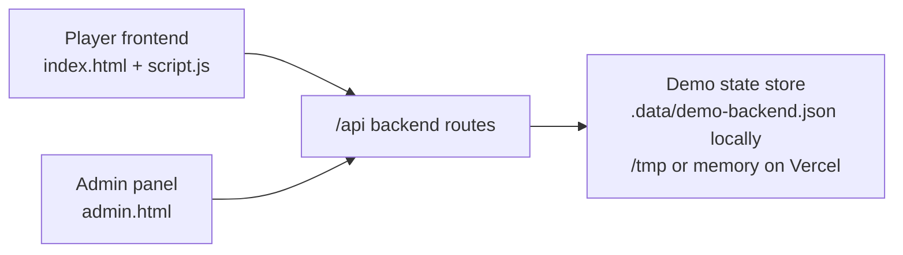

# DDSlot777 Backend MVP

## Scope

This is the first operational loop for the demo site. It is intentionally small:

- Demo user wallet state
- Admin login
- Member list
- Deposit orders
- Deposit confirmation/rejection
- Withdrawal orders
- Withdrawal approval/rejection
- Manual balance adjustment
- Operation logs

The current storage is JSON-backed for local preview and temporary serverless storage for Vercel demo deployment. A real-money system must replace it with a transactional database and add KYC, AML, payment provider callbacks, risk controls, audit retention, and stronger authentication.

## Runtime Containers

## API Contract

### Public/demo wallet

- `POST /api/auth/login`
  - Admin: `{ "username": "admin", "password": "admin123" }`
  - Demo user: `{ "username": "demo", "password": "demo123" }`
- `GET /api/wallet`
  - Requires `Authorization: Bearer demo-user-token`
- `POST /api/deposits`
  - Body: `{ "amount": 20, "method": "Demo Pay" }`
  - Creates a pending deposit order. Balance does not change until admin confirms.
- `POST /api/withdrawals`
  - Body: `{ "amount": 10, "method": "Bank Transfer", "account": "..." }`
  - Creates a pending withdrawal order. Balance is deducted only after admin approval.

### Admin

All admin routes require `Authorization: Bearer demo-admin-token`.

- `GET /api/admin/overview`
- `GET /api/admin/members`
- `POST /api/admin/members/balance`
- `GET /api/admin/deposits`
- `POST /api/admin/deposits/confirm`
- `POST /api/admin/deposits/reject`
- `GET /api/admin/withdrawals`
- `POST /api/admin/withdrawals/review`
- `GET /api/admin/logs`
- `POST /api/admin/reset`

## Data Ownership

- `members.balance` is changed only by:
  - Confirming a deposit
  - Approving a withdrawal
  - Admin manual balance adjustment
- `deposits.status` moves from `pending` to `confirmed` or `rejected`.
- `withdrawals.status` moves from `pending` to `approved` or `rejected`.
- Every money-moving admin action writes an entry to `logs`.

## Next Architecture Decision

When the demo flow is accepted, replace JSON/serverless storage with a transactional database. Supabase Postgres is the simplest next step for this project because it gives hosted Postgres, an API-friendly auth path, and a dashboard without adding much operational burden.
